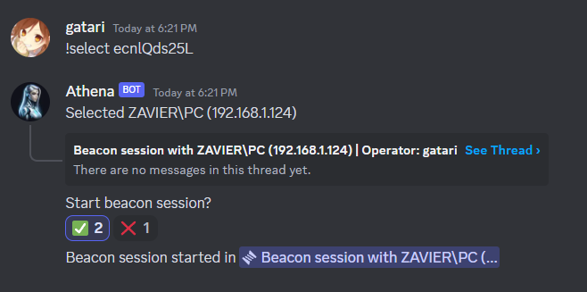

<h1>Athena</h1>

Athena is a Discord client and standalone API wrapper made for integration with [Winton](https://github.com/gatariee/Winton) which allows for operators to interact with their beacons via Discord.
> https://overwatch.fandom.com/wiki/Athena

## Usage

* New beacons will automatically be added to the `!agents` list, and alerts will be sent to the `alert_id` channel if specified.

1. `!agents` - Lists all active beacons connected to the teamserver.
    
2. `!select <uid>` - Selects a beacon to interact with.
    
3. React with either the ✅ to spawn a new beacon session via a thread
    
4. Interact with the beacon via the newly spawned thread.
    
5. Exit the beacon session safely by typing `!exit` & the new thread should be deleted gracefully.

## Environment Variables
1. `token` - Token for your discord bot, can be found from [here](https://discord.com/developers/applications) -> Select Application -> Bot -> *Reset Token*. 
> ⚠️ **WARNING**: Do not share your token with anyone, it is the equivalent to your bot's password!
2. `teamserver` - The IP of your Winton teamserver (e.g 127.0.0.1)
3. `http_listener`- The IP or domain of your HTTP listener on your teamserver (e.g `http://winton.example.com`, `http://127.0.0.1`)
4. `channel_id` - The ID of the channel that you want your bot to be listening on for operator instructions, can be found by right clicking on the channel and selecting *Copy ID*.
5. `alert_id` - The ID of the channel that your bot will be sending beacon alerts to, optional.

## Authorized Users
You can add authorized users to the `authorized_users` list [here](./main.py#L25) to allow users to run beacon commands. You can find a user's ID by right clicking on their name and selecting *Copy ID*.
> ⚠️**WARNING**: Users in this list will be able to interact with your beacons.

## Commands

Athena is in early development, so there are only a few commands available at the moment. Feel free to contribute and add more commands!

## Contribution
If you would like to contribute to Athena, feel free to open a pull request or issue. If you have any questions, feel free to contact me on Discord @ `gatari`

A more functional GUI-client can be found [here](https://github.com/gatariee/Winton/tree/main/client). A full list of available commands on the `implant` is [here](https://github.com/gatariee/Winton/blob/main/implant/cmd/winton.go).

## Note
Similar to [Winton](https://github.com/gatariee/Winton), this project was my first time writing a Discord bot- apologies in advance for the spaghetti code. 🙏